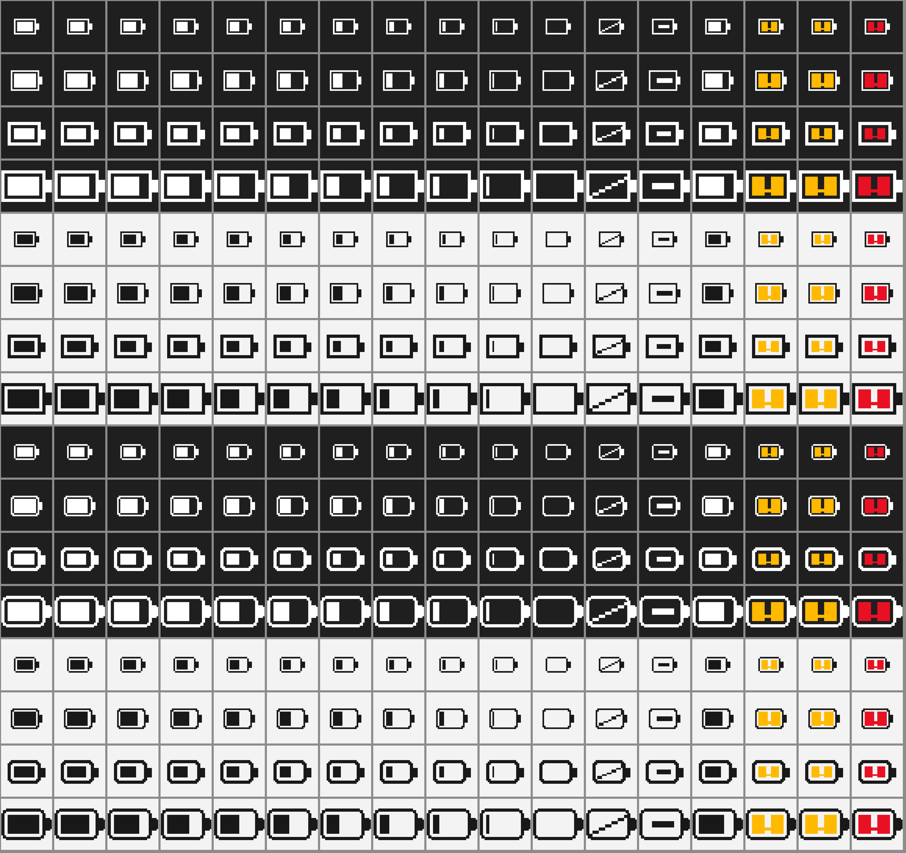

# PS 手柄电量监视器 (PSBatteryTray)

**中文** · [English](README.en.md)

Windows 10 / 11 下的轻量托盘工具：后台读取 **PS4（DualShock 4）/ PS5（DualSense）**
手柄的真实电量并显示在系统托盘上，电量偏低时提醒你。

单文件 exe，**免安装、免管理员权限、无需 Python**，双击即用。



## 功能

- **真实电量**：手柄只上报 11 档（每档 10%），就按档显示"约 75%（等级 7/10）"，不伪造精度
- **多手柄显示最低**：接了多台就显示电量最少的那台，先充最该充的
- **三档低电量提醒**（30% / 20% / 10%）：Toast + 图标闪烁 + 提示音 + 置顶弹窗**多通道**发送 —— Windows 的专注助手会静默吞掉 Toast，只靠它就会漏提醒
- **两套图标风格**：Windows 10（直角）/ Windows 11（圆角），右键菜单随时切换
- **跟随系统亮暗主题**：切换后约 2 秒内自动换色
- **读不到就说读不到**：显示横杠，不残留旧数字；异常值显示"未知"而非 0%，避免误报耗尽
- **只在 `%APPDATA%\PSBatteryTray` 写配置和日志**，不碰注册表以外的地方

## 支持的手柄

| 设备 | USB | 蓝牙 |
|---|---|---|
| DualShock 4 (PS4) | ✅ | ✅ |
| DualSense (PS5) | ✅ | 未实测 |

> DS4 蓝牙可能只发不含电量字段的"精简报告"。程序会识别这种情况并提示，仍会尝试切换到
> 完整报告模式；实在读不到就显示"电量未知"，不会编一个数字。

## 快速开始

1. 下载 `PSBatteryTray.exe`
2. 双击运行 —— 没有主窗口，直接进托盘
3. 想开机自启：右键图标 → 勾选「开机启动」

首次运行若被 SmartScreen 拦下（程序未签名），点「更多信息 → 仍要运行」。

## 使用

**右键**托盘图标可以：看各手柄电量、开关开机启动、切换图标风格、打开日志目录、退出。
**左键**单击图标弹出详情窗口。

## 命令行

```bat
PSBatteryTray.exe --simulate       :: 模拟模式：没手柄也能看完整流程（含低电量提醒）
PSBatteryTray.exe --dump-hid 30    :: 采集 30 秒原始 HID 报告，读数不对时用它排障
PSBatteryTray.exe --reset-config   :: 恢复默认配置
PSBatteryTray.exe --version        :: 查看版本
```

## 从源码构建

```bat
git clone https://github.com/freeeggs/PS-Controller-Battery-Monitoring
cd PS-Controller-Battery-Monitoring
python -m venv .venv && .venv\Scripts\pip install -r requirements.txt
build\build.ps1
```

产物在 `Release\PSBatteryTray.exe`。测试：`python tests\run_tests.py`（96 项）。

## 文档

| 文档 | 内容 |
|---|---|
| [docs/USAGE.md](docs/USAGE.md) | 详细用法、配置项全表、图标规则、已知问题、版本历史 |
| [docs/TECHNICAL_FEASIBILITY.md](docs/TECHNICAL_FEASIBILITY.md) | 协议依据、字节偏移推导、可行性论证 |

## 许可

MIT License —— 见 [LICENSE](LICENSE)。

与索尼无关。"PlayStation""DualShock""DualSense" 是索尼互动娱乐公司的商标。
